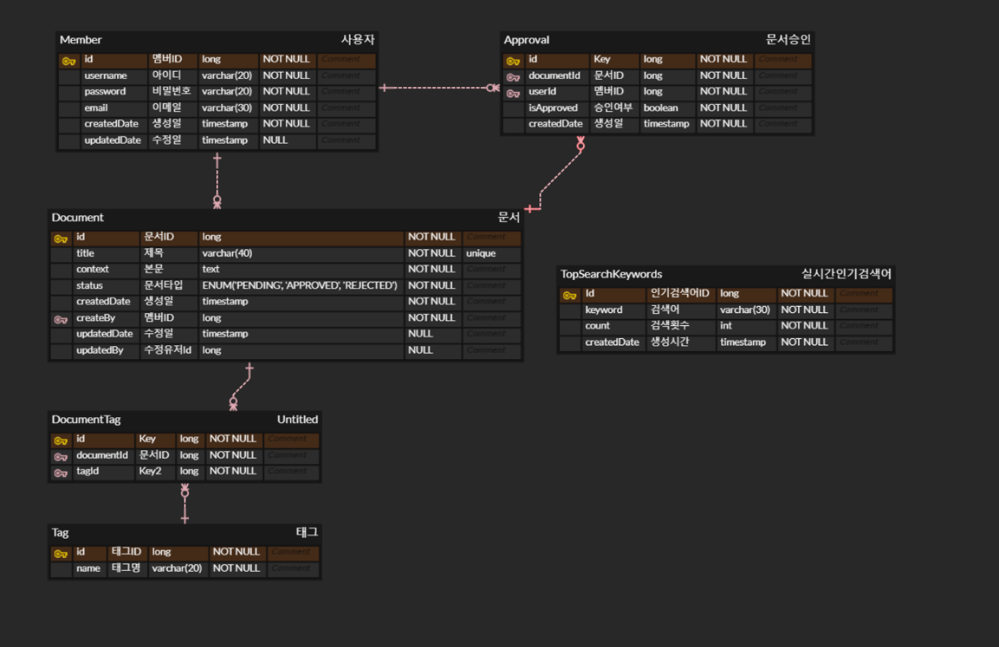
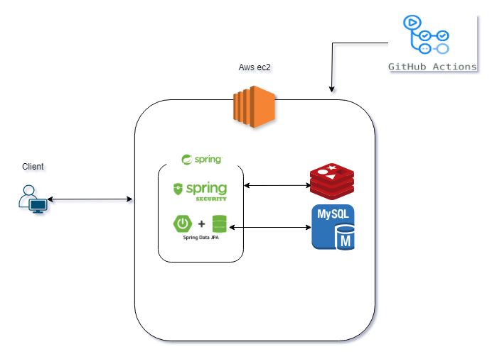

# 위키 서비스

위키백과, 나무위키 등 위키 프로젝트  
다중 사용자 기반 문서 관리 서비스입니다

### 사용기술 
* Spring boot, Jpa, Mysql, Redis, Aws, Spring batch, Elastic search

## 프로젝트 기능 및 설계
* ### 회원관리
  * 회원 가입 기능
    * 사용자는 회원가입을 할 수 있다.
    * 아이디는 unique하며, 비밀번호는 영어, 숫자, 특수문자를 포함해야한다.
    * 회원가입 시 아이디, 비밀번호, 이메일을 입력으로 받는다.
  * 로그인 기능
    * 로그인 시 회원가입 때 사용한 아이디와 비밀번호가 일치하여야한다.
    * Oauth2를 통해 소셜 로그인을 할 수 있다.(카카오)
    * Oauth2통해 가져온 정보가 데이터베이스에 존재하지 않는다면 Oauth2의 정보를 통해 회원가입을 한다.
    * 로그인 시 토큰을 발급해 클라이언트를 인증한다. 
    
* ### 문서 관리
  * 문서 조회 기능
    * 로그인하지 않은 사용자를 포함한 모든 사용자는 문서를 조회할 수 있다.
    * 실시간 검색어는 5분마다 가장많이 검색된 검색어를 기준으로 업데이트 된다.
    * 실시간으로 조회가 많이 된 검색어를 문서 검색 전 조회할 수 있다.
    * 문서는 제목, 내용, 태그를 기반으로 조회할 수 있다.
    * 문서 조회 시 페이징처리되어 응답된다.
    * 문서 조회 시 문서 제목과 작성일, 수정일이 응답된다.
    * 정식 문서로 등록 되지 않은 승인 대기 중인 문서들만 따로 조회할 수 있다.
  * 문서 추가 기능
    * 로그인한 사용자는 문서 추가를 요청할 수 있다.
    * 문서 추가 시 문서의 제목과 내용이 필요하다.
    * 문서 추가를 요청할 시 문서의 제목이 일치하는 문서가 없어야한다.
    * 문서 추가를 요청할 시 문서는 승인 대기 문서 상태가 된다.
  * 문서 편집 기능 
    * 로그인한 사용자는 문서의 편집을 요청할 수 있다.
    * 문서 편집 시 문서의 수정된 내용이 필요하다.
    * 문서 편집은 동시에 한명만 편집이 가능하다.
  * 문서 승인 기능 
    * 로그인한 사용자는 승인 대기 중인 문서를 승인/미승인 할 수 있다.
    * 승인 대기 문서는 추가 요청일 7일 이후에 승인/미승인을 한 사람들 중에서 승인 비율이 70%를 넘고 승인/미승인인원의 합이 10명은 되어야한다.
    * 위 조건을 만족하는 문서는 정식 문서가 되고 그렇지 않은 문서는 폐지한다.

   
# ERD

# 프로젝트 구조

 
## Trouble shooting